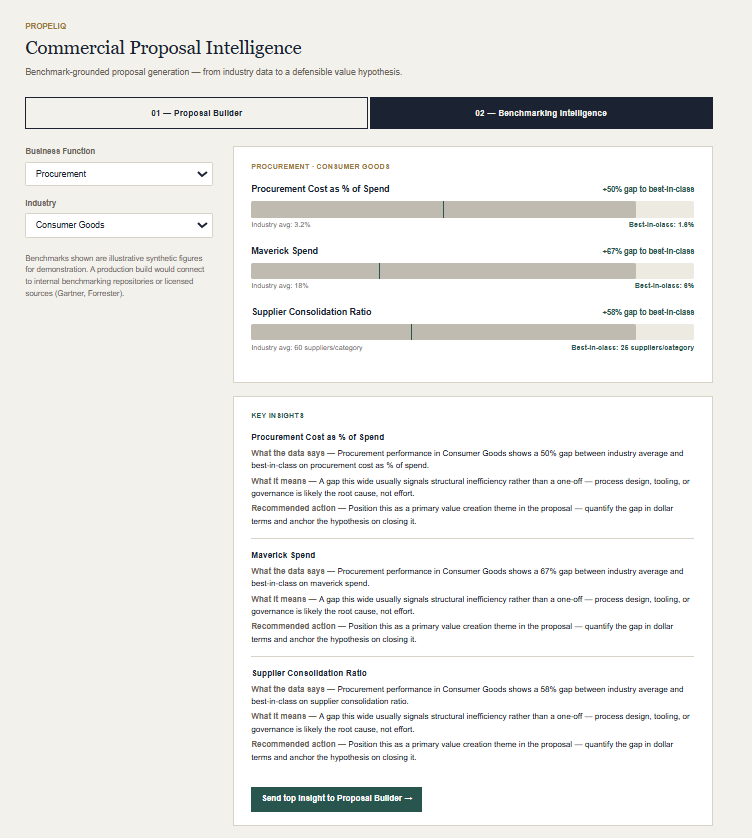
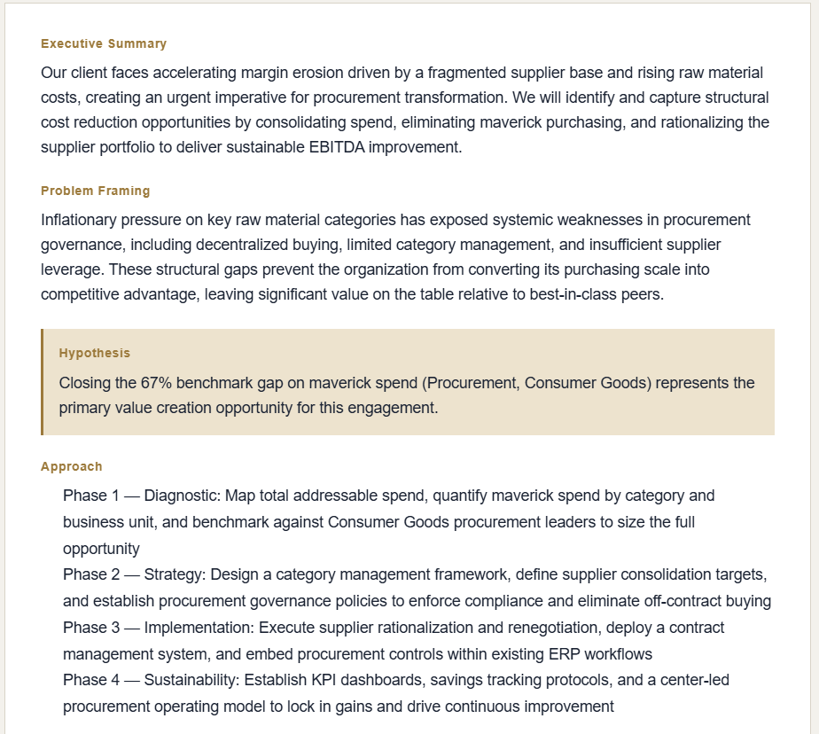

# PropelIQ — AI-Powered Commercial Proposal Intelligence

A two-module portfolio tool that demonstrates the core workflow of a strategy-consulting proposal engagement: benchmark the client against industry data, then turn that data into a defensible, hypothesis-driven proposal — as one connected pipeline rather than two disconnected exercises.

## Screenshots

**Module 02 — Benchmarking Intelligence**

**Module 01 — Proposal Builder (hypothesis locked to benchmark claim)**

## Why this exists

Built to bridge a specific capability gap for a Proposal Development / Cost Transformation consulting role: proposal writing, benchmarking-driven value hypotheses, and MECE narrative structure. Rather than claim the skill on a resume, this tool demonstrates the underlying reasoning process end-to-end.

## The two modules

### 01 — Proposal Builder
Takes client industry, a problem statement, and an engagement type (Cost Reduction / Procurement / Supply Chain / Operations), and generates a structured proposal outline: Executive Summary, Problem Framing, Hypothesis, Approach, and Value Creation Themes.

A **Storytelling Check** reviews the generated outline against the client's *original, unedited* input and flags:
- Whether the hypothesis is genuinely specific rather than vague
- Whether the narrative flows logically from problem → hypothesis → approach → value themes
- Whether there are enough distinct value creation themes to feel substantive
- Whether the original problem statement itself had enough specificity to support real narrative tension
- **Groundedness** — whether the outline's specificity is actually traceable to what the client said, or fabricated on top of a thin input

That last check exists because early testing surfaced a real failure mode: given a near-empty problem statement ("Costs are too high"), the model confidently invented precise-sounding numbers ($50–80M in savings, a 400→150 vendor consolidation) with no basis in the input. The generation prompt was tightened to avoid manufacturing false precision on thin inputs, and the Storytelling Check was given the original input alongside the outline so it can catch fabricated specificity even when the outline reads smoothly.

### 02 — Benchmarking Intelligence
Takes a business function (Procurement, Supply Chain, Manufacturing, Operations, HR) and an industry (Financial Services, Consumer Goods, Technology), and shows benchmark ranges for key cost and efficiency metrics against industry average and best-in-class, as a visual comparison.

A **Key Insights** panel below the benchmarks demonstrates the insight → implication → recommendation chain for each metric:
- **What the data says** — the size of the gap
- **What it means** — whether the gap suggests structural inefficiency, a targeted fix, or an already-strong position
- **Recommended action** — how prominently to feature it in a proposal narrative

### The connection
The highest-gap metric from a Module 2 benchmark run can be sent directly into Module 1 ("Send top insight to Proposal Builder"), where it becomes a locked value hypothesis for the generated outline — turning a data point into the spine of the proposal's argument, rather than keeping benchmarking and proposal-writing as separate exercises.

## Running this tool

This tool is built as a React artifact for the Claude.ai artifact environment, where the Anthropic API proxy is handled automatically — no API key needed if you're running it there.

If you want to run it outside Claude.ai (e.g. in a local React project), you will need your own Anthropic API key. The `fetch` call in `propeliq.jsx` goes directly to `https://api.anthropic.com/v1/messages` — replace or wrap that with your own authenticated request. You can get an API key at [console.anthropic.com](https://console.anthropic.com).

Note: running the tool locally from a browser will hit CORS restrictions — you'll need a backend proxy or server-side wrapper to safely pass your API key.

## Tech stack
- React (single-file component)
- Claude API (`claude-sonnet-4-6`) — powers outline generation and the Storytelling Check
- Synthetic benchmark data, hardcoded as JSON — illustrative figures for demonstration; a production build would connect to internal benchmarking repositories or licensed sources (Gartner, Forrester)

## Synthetic data coverage
5 business functions × 3 industries, each with 2–3 benchmark metrics (industry average vs. best-in-class). Manufacturing × Financial Services is intentionally left as an empty state rather than a fabricated number, since manufacturing metrics don't meaningfully apply to a bank. HR cost is indexed to market median = 100 rather than a fixed currency, so it isn't geography-locked.

## What's rule-based vs. AI-generated
- **AI-generated (Claude API):** proposal outline text, Storytelling Check evaluation
- **Rule-based (deterministic):** benchmark gap calculations, Key Insights panel text, highest-gap metric selection for the Module 2 → Module 1 handoff

This split is deliberate — benchmarking math should be reliable and auditable, while narrative generation and qualitative review benefit from the model's judgment.

## Known limitations
- Benchmark data is synthetic and illustrative, not sourced from licensed industry data
- The tool doesn't currently validate whether a *mismatched* inherited hypothesis (e.g. sent from an unrelated function/industry) is a sensible fit before locking it into generation — it will apply it as instructed
- Storytelling Check and outline generation are single-turn calls with no conversation memory between regenerations
